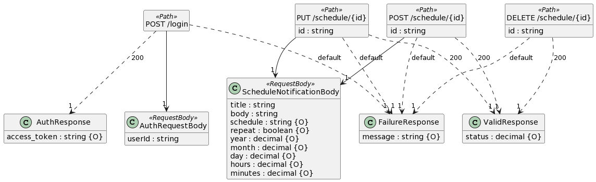

# Firebase Cloud Messaging Server

## Setup Firebase service Account
* Login to your Firebase account
* Click the gear icon
* Select project settings
* Click Service accounts
* Click create service account button
* Download service key file, convert the json data to yml and paste it in the config/default.yml file

  ```yml
  firebase:
    document: users
    serviceKey: paste your service account key here
  ```

## Clone the repo

```bash
git clone https://github.com/julekgwa/firebase-fcm-server.git
cd firebase-fcm-server
#run npm install or yarn
#run npm start or yarn start
```

## k8s
```bash
cd k8s

kubectl apply -f deployment.yml
kubectl apply -f ingress-svc.yml

#or create cluster locally using kind https://kind.sigs.k8s.io/
kind create cluster --config cluster.yml
```

## UML



## License
```bash
Licensed under the Apache License, Version 2.0 (the "License");
you may not use this file except in compliance with the License.
You may obtain a copy of the License at

    http://www.apache.org/licenses/LICENSE-2.0

Unless required by applicable law or agreed to in writing, software
distributed under the License is distributed on an "AS IS" BASIS,
WITHOUT WARRANTIES OR CONDITIONS OF ANY KIND, either express or implied.
See the License for the specific language governing permissions and
limitations under the License.